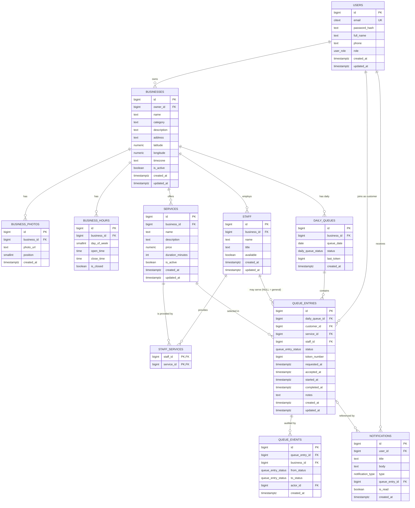

# QueueLess — Database Design (PostgreSQL)

**Project:** QueueLess
**Document Version:** 1.0
**Status:** Draft
**Related Documents:** SRS v1.0, Use Cases v1.0, HLD v1.0

> This document defines the PostgreSQL schema for the QueueLess MVP. It translates the HLD components (`User → Business → Staff → Service → Daily Queue → Queue Entry → Queue Events`) into concrete tables, constraints, indexes, and concurrency strategies.

The design is explicitly **MVP-friendly**:
* No microservices, Kafka, CQRS, or event sourcing.
* Redis and WebSockets (for real-time) are deployment concerns, **not** data concerns — PostgreSQL remains the **single source of truth** for queue state.
* All schema decisions are expressed as plain PostgreSQL tables/types/constraints.

---

## 1. Design Principles

1. **A single `users` table** — Customer and Business Owner are both users differentiated by a `role` column.
2. **Staff have no accounts** — they are rows owned by a business, managed by the business owner.
3. **One daily queue per business per day** — keyed by `(business_id, queue_date)`.
4. **Token ≠ Position** — token is a persistent per-day sequential id; position is **computed on read**, never stored as authoritative state.
5. **Queue state is authoritative in PostgreSQL** — all transitions go through transactional writes guarded by row locks / conditional updates.
6. **Analytics are derived** — there is no analytics table; counts and peak hours come from `queue_entries` + `queue_events`.
7. **Notifications are persistable** — a `notifications` table gives in-app notifications a durable home.

---

## 2. Enumerated Types

```sql
-- Who is the user?
CREATE TYPE user_role AS ENUM ('CUSTOMER', 'BUSINESS_OWNER');

-- Daily queue open/closed state
CREATE TYPE daily_queue_status AS ENUM ('OPEN', 'CLOSED');

-- Queue entry lifecycle
CREATE TYPE queue_entry_status AS ENUM (
    'REQUESTED',        -- submitted, waiting for owner decision
    'ACCEPTED',         -- accepted, token assigned
    'WAITING',          -- in the active queue, waiting for a turn
    'CALLED',           -- (optional) owner has called the customer
    'IN_SERVICE',       -- currently being served
    'COMPLETED',        -- service finished
    'REJECTED',         -- owner declined the request
    'CANCELLED',        -- customer left / request withdrawn
    'SKIPPED',          -- owner skipped
    'NO_SHOW'           -- customer did not arrive
);

-- Notification category
CREATE TYPE notification_type AS ENUM (
    'QUEUE_ACCEPTED',
    'REQUEST_REJECTED',
    'TURN_APPROACHING',
    'TURN_REACHED',
    'QUEUE_CLOSED',
    'GENERAL'
);
```

The primary life-cycle path is:

```
REQUESTED → ACCEPTED → WAITING → (CALLED) → IN_SERVICE → COMPLETED
```

Terminal/alternative outcomes: `REJECTED`, `CANCELLED`, `SKIPPED`, `NO_SHOW`.

> **Note:** `ACCEPTED` and `WAITING` may be collapsed into a single atomic transition in code, but both are kept as states to match the requirement and to preserve an auditable distinction in `queue_events`. `CALLED` is optional and may be skipped in the UI flow.

---

## 3. Tables, Columns, Types

### 3.1 `users`

| Column         | Type         | Nullable | Notes                              |
| -------------- | ------------ | -------- | ---------------------------------- |
| `id`           | `BIGSERIAL`  | PK       |                                    |
| `email`        | `CITEXT`     | NOT NULL | case-insensitive, UNIQUE           |
| `password_hash`| `TEXT`       | NOT NULL |                                    |
| `full_name`    | `TEXT`       | NOT NULL |                                    |
| `phone`        | `TEXT`       | NULL     |                                    |
| `role`         | `user_role`  | NOT NULL | `CUSTOMER` or `BUSINESS_OWNER`     |
| `created_at`   | `TIMESTAMPTZ`| NOT NULL | `DEFAULT now()`                    |
| `updated_at`   | `TIMESTAMPTZ`| NOT NULL | `DEFAULT now()`                    |

### 3.2 `businesses`

| Column        | Type          | Nullable | Notes                            |
| ------------- | ------------- | -------- | -------------------------------- |
| `id`          | `BIGSERIAL`   | PK       |                                  |
| `owner_id`    | `BIGINT`      | NOT NULL | FK → `users.id`                  |
| `name`        | `TEXT`        | NOT NULL |                                  |
| `category`    | `TEXT`        | NOT NULL | e.g. Salon, Clinic, Repair Shop   |
| `description` | `TEXT`        | NULL     |                                  |
| `address`     | `TEXT`        | NULL     | human-readable address           |
| `latitude`    | `NUMERIC(9,6)`| NULL     | for nearby search                |
| `longitude`   | `NUMERIC(9,6)`| NULL     | for nearby search                |
| `timezone`    | `TEXT`        | NOT NULL | `DEFAULT 'UTC'`; used to compute the "business day" |
| `is_active`   | `BOOLEAN`     | NOT NULL | `DEFAULT true`                   |
| `created_at`  | `TIMESTAMPTZ` | NOT NULL | `DEFAULT now()`                  |
| `updated_at`  | `TIMESTAMPTZ` | NOT NULL | `DEFAULT now()`                  |

### 3.3 `business_photos`

| Column        | Type         | Nullable | Notes                                    |
| ------------- | ------------ | -------- | ---------------------------------------- |
| `id`          | `BIGSERIAL`  | PK       |                                          |
| `business_id` | `BIGINT`     | NOT NULL | FK → `businesses.id` (`ON DELETE CASCADE`) |
| `photo_url`   | `TEXT`       | NOT NULL |                                          |
| `position`    | `SMALLINT`   | NOT NULL | `DEFAULT 0`; display order               |
| `created_at`  | `TIMESTAMPTZ`| NOT NULL | `DEFAULT now()`                          |

### 3.4 `business_hours`

| Column        | Type         | Nullable | Notes                                          |
| ------------- | ------------ | -------- | ---------------------------------------------- |
| `id`          | `BIGSERIAL`  | PK       |                                                |
| `business_id` | `BIGINT`     | NOT NULL | FK → `businesses.id`                           |
| `day_of_week` | `SMALLINT`   | NOT NULL | `0 = Sunday … 6 = Saturday`                    |
| `open_time`   | `TIME`       | NULL     | NULL when the business is closed that day      |
| `close_time`  | `TIME`       | NULL     |                                                |
| `is_closed`   | `BOOLEAN`    | NOT NULL | `DEFAULT false`                                |

* Unique: `(business_id, day_of_week)` — exactly one row per weekday.

### 3.5 `services`

| Column            | Type          | Nullable | Notes                              |
| ----------------- | ------------- | -------- | ---------------------------------- |
| `id`              | `BIGSERIAL`   | PK       |                                    |
| `business_id`     | `BIGINT`      | NOT NULL | FK → `businesses.id`               |
| `name`            | `TEXT`        | NOT NULL | e.g. Haircut                       |
| `description`     | `TEXT`        | NULL     |                                    |
| `price`           | `NUMERIC(10,2)`| NULL    | **optional** pricing               |
| `duration_minutes`| `INT`          | NULL     | used by the ETA engine; optional   |
| `is_active`       | `BOOLEAN`      | NOT NULL | `DEFAULT true`                     |
| `created_at`      | `TIMESTAMPTZ`  | NOT NULL | `DEFAULT now()`                    |
| `updated_at`      | `TIMESTAMPTZ`  | NOT NULL | `DEFAULT now()`                    |

* Unique: `(business_id, name)`.

### 3.6 `staff`

| Column        | Type         | Nullable | Notes                            |
| ------------- | ------------ | -------- | -------------------------------- |
| `id`          | `BIGSERIAL`  | PK       |                                  |
| `business_id` | `BIGINT`     | NOT NULL | FK → `businesses.id`             |
| `name`        | `TEXT`       | NOT NULL |                                  |
| `title`       | `TEXT`       | NULL     | e.g. "Senior Barber"             |
| `available`   | `BOOLEAN`    | NOT NULL | `DEFAULT true`; owner toggles    |
| `created_at`  | `TIMESTAMPTZ`| NOT NULL | `DEFAULT now()`                  |
| `updated_at`  | `TIMESTAMPTZ`| NOT NULL | `DEFAULT now()`                  |

* Unique: `(business_id, name)`.
* No `user_id` — staff have **no accounts** in the MVP.

### 3.7 `staff_services` (many-to-many)

| Column       | Type      | Nullable | Notes                    |
| ------------ | --------- | -------- | ------------------------ |
| `staff_id`   | `BIGINT`  | PK (part)| FK → `staff.id`          |
| `service_id` | `BIGINT`  | PK (part)| FK → `services.id`       |

* Composite PK `(staff_id, service_id)`.
* Models "a staff member can provide multiple services".
* Optional in the MVP: a business with no staff simply has no rows here.

### 3.8 `daily_queues`

| Column        | Type                | Nullable | Notes                                              |
| ------------- | ------------------- | -------- | -------------------------------------------------- |
| `id`          | `BIGSERIAL`         | PK       |                                                    |
| `business_id` | `BIGINT`            | NOT NULL | FK → `businesses.id`                                |
| `queue_date`  | `DATE`              | NOT NULL | the business operating day                          |
| `status`      | `daily_queue_status`| NOT NULL | `DEFAULT 'CLOSED'`; owner opens → `OPEN`            |
| `last_token`  | `BIGINT`            | NOT NULL | `DEFAULT 0`; **token counter**, see §7              |
| `created_at`  | `TIMESTAMPTZ`       | NOT NULL | `DEFAULT now()`                                     |

* Unique: `(business_id, queue_date)` — **exactly one daily queue per business per day**.
* Closed queues stay in the table indefinitely for history/analytics.

### 3.9 `queue_entries` (core)

| Column         | Type                 | Nullable | Notes                                                        |
| -------------- | -------------------- | -------- | ------------------------------------------------------------ |
| `id`           | `BIGSERIAL`          | PK       | doubles as the FIFO insertion-order key                      |
| `daily_queue_id`| `BIGINT`            | NOT NULL | FK → `daily_queues.id`                                       |
| `customer_id`  | `BIGINT`             | NOT NULL | FK → `users.id` (role = CUSTOMER)                            |
| `service_id`   | `BIGINT`             | NOT NULL | FK → `services.id`                                           |
| `staff_id`     | `BIGINT`             | NULL     | FK → `staff.id`; **NULL = "Any Available Staff"** (general queue) |
| `status`       | `queue_entry_status` | NOT NULL | `DEFAULT 'REQUESTED'`                                        |
| `token_number` | `BIGINT`             | NULL     | assigned on acceptance, not before                            |
| `requested_at` | `TIMESTAMPTZ`        | NOT NULL | `DEFAULT now()`                                              |
| `accepted_at`  | `TIMESTAMPTZ`        | NULL     | set when accepted; **FIFO ordering key** (with `id`)         |
| `started_at`   | `TIMESTAMPTZ`        | NULL     | when moved to `IN_SERVICE`                                   |
| `completed_at` | `TIMESTAMPTZ`        | NULL     | when moved to any terminal state                             |
| `notes`        | `TEXT`               | NULL     | owner/customer notes                                         |
| `created_at`   | `TIMESTAMPTZ`        | NOT NULL | `DEFAULT now()`                                              |
| `updated_at`   | `TIMESTAMPTZ`        | NOT NULL | `DEFAULT now()`                                              |

### 3.10 `queue_events`

Append-only audit trail of every state transition. Feeds **notifications** and **analytics** (peak hours, counts).

| Column          | Type                 | Nullable | Notes                                        |
| --------------- | -------------------- | -------- | -------------------------------------------- |
| `id`            | `BIGSERIAL`          | PK       |                                              |
| `queue_entry_id`| `BIGINT`             | NOT NULL | FK → `queue_entries.id`                      |
| `business_id`   | `BIGINT`             | NOT NULL | FK → `businesses.id` (denormalized for analytics) |
| `from_status`   | `queue_entry_status` | NULL     | NULL for the initial `REQUESTED` event       |
| `to_status`     | `queue_entry_status` | NOT NULL |                                              |
| `actor_id`      | `BIGINT`             | NULL     | FK → `users.id`; who performed the action    |
| `created_at`    | `TIMESTAMPTZ`        | NOT NULL | `DEFAULT now()` — used for peak-hour analysis |

### 3.11 `notifications`

| Column          | Type               | Nullable | Notes                                   |
| --------------- | ------------------ | -------- | --------------------------------------- |
| `id`            | `BIGSERIAL`        | PK       |                                         |
| `user_id`       | `BIGINT`           | NOT NULL | FK → `users.id` (recipient)             |
| `title`         | `TEXT`             | NOT NULL |                                         |
| `body`          | `TEXT`             | NOT NULL |                                         |
| `type`          | `notification_type`| NOT NULL |                                         |
| `queue_entry_id`| `BIGINT`           | NULL     | FK → `queue_entries.id`, for deep-link  |
| `is_read`       | `BOOLEAN`          | NOT NULL | `DEFAULT false`                         |
| `created_at`    | `TIMESTAMPTZ`      | NOT NULL | `DEFAULT now()`                         |

---

## 4. Primary Keys & Foreign Keys

### Primary keys
Every table uses a single `BIGSERIAL id` PK, except the join table `staff_services` which uses a composite PK `(staff_id, service_id)`.

### Foreign keys

| Child          | Column            | Parent        | Column    | Action         |
| -------------- | ----------------- | ------------- | --------- | -------------- |
| `businesses`   | `owner_id`        | `users`       | `id`      | RESTRICT       |
| `business_photos` | `business_id`  | `businesses`  | `id`      | CASCADE        |
| `business_hours`  | `business_id`   | `businesses`  | `id`      | CASCADE        |
| `services`     | `business_id`     | `businesses`  | `id`      | CASCADE        |
| `staff`        | `business_id`     | `businesses`  | `id`      | CASCADE        |
| `staff_services` | `staff_id`      | `staff`       | `id`      | CASCADE        |
| `staff_services` | `service_id`    | `services`    | `id`      | CASCADE        |
| `daily_queues` | `business_id`     | `businesses`  | `id`      | CASCADE        |
| `queue_entries`| `daily_queue_id`  | `daily_queues`| `id`      | CASCADE        |
| `queue_entries`| `customer_id`     | `users`       | `id`      | RESTRICT       |
| `queue_entries`| `service_id`      | `services`    | `id`      | RESTRICT       |
| `queue_entries`| `staff_id`        | `staff`       | `id`      | RESTRICT (nullable) |
| `queue_events` | `queue_entry_id`  | `queue_entries`| `id`     | CASCADE        |
| `queue_events` | `business_id`     | `businesses`  | `id`      | RESTRICT       |
| `queue_events` | `actor_id`        | `users`       | `id`      | SET NULL       |
| `notifications`| `user_id`         | `users`       | `id`      | CASCADE        |
| `notifications`| `queue_entry_id`  | `queue_entries`| `id`     | SET NULL       |

> **Note on CASCADE for queue rows:** `queue_entries` are **never** deleted in normal operation; they are terminal-state rows kept for analytics. Deleting a `daily_queues`/`business` cascades purely as an administrative cleanup mechanism.

---

## 5. Relationships (summary)

* A **User** (`CUSTOMER` or `BUSINESS_OWNER`) — one user has 0..N businesses (as owner) and 0..N queue entries (as customer).
* A **Business** has 0..N photos, 0..N weekly `business_hours` rows, 0..N services, 0..N staff.
* A **Staff** belongs to one business and provides 0..N services (via `staff_services`).
* A **Service** belongs to one business and is provided by 0..N staff members.
* A **Business** has exactly one `daily_queues` row **per operating day**.
* A **Daily Queue** has 0..N `queue_entries`.
* A **Queue Entry** references one customer, one service, at most one staff member (or the general queue), and one daily queue.
* A **Queue Entry** has 1..N `queue_events` (its lifecycle audit trail).
* **Notifications** target a user and optionally reference a queue entry.

---

## 6. Important Constraints

1. **Email uniqueness** — `users.email` UNIQUE (case-insensitive via `CITEXT`).
2. **One daily queue per business/day** — UNIQUE `(business_id, queue_date)`.
3. **One hours row per weekday** — UNIQUE `(business_id, day_of_week)`.
4. **Service name unique per business** — UNIQUE `(business_id, name)` on `services`.
5. **Staff name unique per business** — UNIQUE `(business_id, name)` on `staff`.
6. **Staff must be available to be selected** — enforced in the application layer (FR-13); a `staff.available = false` row cannot receive a new `queue_entries` row with that `staff_id`.
7. **New requests only on OPEN queues** — enforced transactionally (BR-06); require `daily_queues.status = 'OPEN'` at insert time.
8. **Token assigned only on acceptance** — `token_number` stays NULL while `status = 'REQUESTED'`.
9. **Token uniqueness** — a partial unique index on `(daily_queue_id, token_number)` **WHERE `token_number IS NOT NULL`** (backstop; the counter in §7 already guarantees it).
10. **A customer cannot double-join an active queue** — partial unique index on `(customer_id, daily_queue_id)` **WHERE `status IN ('REQUESTED','ACCEPTED','WAITING','CALLED','IN_SERVICE')`**.
11. **Valid state transitions** — enforced by the application/queue-engine, optionally backed by a trigger. Only the transitions listed in §2 are allowed.
12. **Same-business referential sanity** — `queue_entries.staff_id` and `queue_entries.service_id` must belong to the same business as `queue_entries.daily_queue_id`. Not expressible as a plain FK (multi-hop), so enforced in the application layer within the same transaction.

### Partial unique indexes

```sql
CREATE UNIQUE INDEX uq_queue_entry_token
    ON queue_entries(daily_queue_id, token_number)
    WHERE token_number IS NOT NULL;

CREATE UNIQUE INDEX uq_customer_active_in_queue
    ON queue_entries(customer_id, daily_queue_id)
    WHERE status IN ('REQUESTED','ACCEPTED','WAITING','CALLED','IN_SERVICE');
```

---

## 7. Indexes (query support)

```sql
-- FIFO ordering + position calculation
CREATE INDEX idx_queue_entry_queue
    ON queue_entries(daily_queue_id, staff_id, status, accepted_at, id);

-- "Active count in a specific staff/general queue" scans
CREATE INDEX idx_queue_entry_active
    ON queue_entries(daily_queue_id, staff_id)
    WHERE status IN ('WAITING','CALLED','IN_SERVICE');

-- Customer's own entries (dashboard + already-in-queue check)
CREATE INDEX idx_queue_entry_customer
    ON queue_entries(customer_id, status);

-- Analytics: daily counts and peak hours
CREATE INDEX idx_queue_event_business_time
    ON queue_events(business_id, created_at);

-- Owner's business lookup + search/nearby
CREATE INDEX idx_business_owner   ON businesses(owner_id);
CREATE INDEX idx_business_category ON businesses(category);
CREATE INDEX idx_business_location ON businesses(latitude, longitude);

-- Notifications inbox
CREATE INDEX idx_notification_user ON notifications(user_id, is_read);

-- Resolve daily queue for a business/day
CREATE INDEX idx_daily_queue_biz_date ON daily_queues(business_id, queue_date);
```

> For **nearby** search the MVP can use a bounding-box query on `(latitude, longitude)`. A `PostGIS` `GIST` index can be added later if true geo-distance is needed; it is **not** required for the MVP.

---

## 8. Token-Generation / Concurrency Strategy

**Token = unique sequential integer per business per day.** Because there is exactly one `daily_queues` row per `(business_id, queue_date)`, we store a counter directly on that row and use an atomic update to allocate tokens.

### Allocation (inside the "accept" transaction)

```sql
-- Atomically claim the next token; the UPDATE takes an exclusive row lock,
-- serializing all concurrent allocations for this business/day.
UPDATE daily_queues
SET    last_token = last_token + 1
WHERE  id = :daily_queue_id          -- :daily_queue_id is the business/day row
RETURNING last_token AS token_number;
```

* The `UPDATE … RETURNING` on the single `daily_queues` row (which is also the row being unlocked/locked) acquires an **exclusive row lock**. Any concurrent accept for the **same business/day** blocks until this row lock is released, guaranteeing a gap-free, unique token.
* Different businesses/days are **independent rows** → fully parallel, no global sequence bottleneck.
* Token is written to `queue_entries.token_number` in the **same transaction** as the state change `REQUESTED → ACCEPTED`, so a token is never "issued" without an accepted entry.
* The partial unique index (§6.9) is a final safety net.

**Why not a global SEQUENCE?** A global sequence would produce tokens that are unique but *not* reset/sequential per business/day (e.g. business A gets #5, #9 while business B gets #6, #7). The counter-on-row approach keeps tokens naturally sequential and per-day reset, which matches the product requirement.

---

## 9. Queue-Position Strategy

**Position is computed on read; it is never stored as authoritative state.** This avoids write races entirely and keeps position always correct when entries ahead leave the queue.

A queue entry "belongs to a queue" identified by:

```sql
(daily_queue_id, staff_id)        -- staff_id NULL means the general queue
```

**Pseudo-SQL** for the current position of entry `e`:

```sql
SELECT
    1 + COUNT(*) AS position
FROM queue_entries e2
WHERE e2.daily_queue_id = e.daily_queue_id
  AND e2.staff_id IS NOT DISTINCT FROM e.staff_id   -- NULL-safe: matches both general & specific
  AND e2.status IN ('WAITING', 'CALLED', 'IN_SERVICE')
  AND (e2.accepted_at, e2.id) < (e.accepted_at, e.id)   -- FIFO ordering
```

Notes:
* `staff_id IS NOT DISTINCT FROM e.staff_id` makes the same query work for a specific staff queue **and** the general queue (`NULL`).
* Only active-status entries (`WAITING`, `CALLED`, `IN_SERVICE`) count; `COMPLETED`, `REJECTED`, `CANCELLED`, `SKIPPED`, `NO_SHOW` disappear from the ordering automatically — which is exactly the dynamic "jump ahead" behavior required.
* **FIFO determinism** comes from `(accepted_at, id)`: `accepted_at` is the moment the customer entered the live queue (on acceptance), and `id` breaks ties for identical timestamps.
* The whole "active queue" list is just the same base query **without** the `(accepted_at, id) <` filter, ordered by `(accepted_at, id)` — one query shape serves both "list the queue" and "my position", keeping the code simple.

---

## 10. How "Any Available Staff" Is Represented

It is represented on the queue entry by **`staff_id IS NULL`** — i.e. the entry belongs to the business's **general queue** for that day.

* `queue_entries.staff_id = <id>` → the customer is in that specific staff member's queue.
* `queue_entries.staff_id IS NULL` → the customer chose **Any Available Staff** and is in the general queue.

The position/ordering query in §9 already handles this via `staff_id IS NOT DISTINCT FROM e.staff_id`, so the general queue is simply the partition where both sides are `NULL`.

**Assignment (MVP):** the actual *assignment* of an "Any Available Staff" customer to a concrete staff member at serve time is a **queue-engine** decision made at `WAITING → IN_SERVICE`. For the MVP the business owner performs the assignment manually (they pick which available staff serves the general-queue customer when they tap "Serve"). This keeps the schema simple and avoids an automatic load-balancing algorithm in the MVP. The entry's `staff_id` field can be updated to the chosen staff member at that moment if the business wants to record the actual provider; otherwise it stays `NULL` and analytics treat it as general.

---

## 11. Critical Transaction / Race-Condition Handling

All of the following run as **single database transactions** with row-level locking / conditional updates. PostgreSQL guarantees atomic visibility.

### 11.1 Two owners accept the same request (double-accept)

Guard with a **conditional UPDATE that only matches the requestable state**:

```sql
UPDATE queue_entries
SET    status       = 'ACCEPTED',
       token_number = :token,          -- from §8
       accepted_at  = now(),
       updated_at   = now()
WHERE  id = :entry_id
  AND  status = 'REQUESTED'
RETURNING id;
```

* Exactly one concurrent `UPDATE` will match `status = 'REQUESTED'`; the second finds `ROW_COUNT = 0` and is rejected. Combined with the token allocation (§8) in the same transaction, an entry can never be accepted twice nor receive two tokens.

### 11.2 Two owners serve the same customer (double-serve)

Same pattern with a state guard (`WAITING` → `IN_SERVICE`):

```sql
UPDATE queue_entries
SET    status     = 'IN_SERVICE',
       started_at = now(),
       updated_at = now()
WHERE  id = :entry_id
  AND  status = 'WAITING'
RETURNING id;                          -- ROW_COUNT = 0 => already taken
```

### 11.3 Two owners "serve the next customer" simultaneously

Because `status` transitions use guarded conditional updates, the two `serve-next` attempts resolve to **different** entries — each inquiry grabs the next *still-`WAITING`* entry. No customer can be served by two owners.

### 11.4 Joining while the queue closes / customer double-joins

The insert of a `REQUESTED` entry re-checks `daily_queues.status = 'OPEN'` and relies on the unique partial index `uq_customer_active_in_queue` (§6.10) to reject a second concurrent join for the same customer in the same daily queue.

### 11.5 Token race (same business/day)

Solved by the atomic single-row `UPDATE` on `daily_queues.last_token` (§8), which serializes allocations per business/day.

### 11.6 Transaction + event consistency

Each state change writes:
1. the guarded `queue_entries` update (the authoritative state), **and**
2. the corresponding `queue_events` audit row, and optionally
3. a `notifications` row

…all within **one transaction**, so state, audit trail, and notification are always consistent. Redis/WebSocket fan-out happens *after* commit and is treated as best-effort live refresh — never the source of truth.

---

## 12. Analytics (derived, no extra tables)

All MVP analytics are **SQL aggregations** over `queue_entries` and `queue_events`; no pre-aggregation tables are needed at this scale.

* **Daily customers** — `COUNT(*)` on `queue_entries` grouped by `daily_queues.queue_date`.
* **Served** — `COUNT(*) WHERE status = 'COMPLETED'` (per day).
* **Cancelled / Skipped / No-Show / Rejected** — `COUNT(*)` where `status IN ('CANCELLED','SKIPPED','NO_SHOW','REJECTED')`, grouped by day.
* **Peak hours** — `date_trunc('hour', queue_events.created_at)` grouped over the day, filtered to entries into `WAITING`/`IN_SERVICE`. The `idx_queue_event_business_time` index supports this.
* **Per-staff breakdown** (optional) — group by `queue_entries.staff_id`.

If query volume grows, the team may introduce a per-day aggregation table later; it is deliberately excluded from the MVP.

---

## 13. MVP Schema Summary

| Table             | Purpose                                        |
| ----------------- | ---------------------------------------------- |
| `users`           | Customers & business owners                    |
| `businesses`      | Business profiles                             |
| `business_photos` | Multiple photos per business                   |
| `business_hours`  | Weekly opening hours per business              |
| `services`        | Business services with optional pricing        |
| `staff`           | Service providers (no accounts)                |
| `staff_services`  | Which staff provide which services             |
| `daily_queues`    | One per business per operating day + token counter |
| `queue_entries`   | The queue membership & lifecycle state          |
| `queue_events`    | Append-only audit of every transition          |
| `notifications`   | Persisted in-app notifications                 |

---

## 14. Mermaid ER Diagram



---

## 15. Open Items / Follow-ups

* Collapse `ACCEPTED`/`WAITING` (and optional `CALLED`) — final decision belongs to the LLD queue-engine state table.
* "Serve next" for the **general queue**: confirm whether the owner picks the staff member manually (default) or whether LLD specifies an automatic assignment rule.
* Whether to add `PostGIS` for near-by search now or defer to the LLD.
* Migration tooling (e.g. Alembic) and seed data will be covered in the LLD.

---

### Documentation progress

| Document          | Status       |
| ----------------- | ------------ |
| SRS               | ✅ v1.0 Draft |
| Use Cases         | ✅ v1.0 Draft |
| HLD               | ✅ v1.0 Draft |
| **Database Design** | ✅ v1.0 Draft |
| LLD               | ⏳ Later      |
| API Specification | ⏳ Later      |
| Testing Strategy  | ⏳ Later      |
| Deployment        | ⏳ Later      |

**Next:** LLD me hum is schema ko queue-engine state transitions, token/position queries, aur transaction flow ke saath implement karenge.
